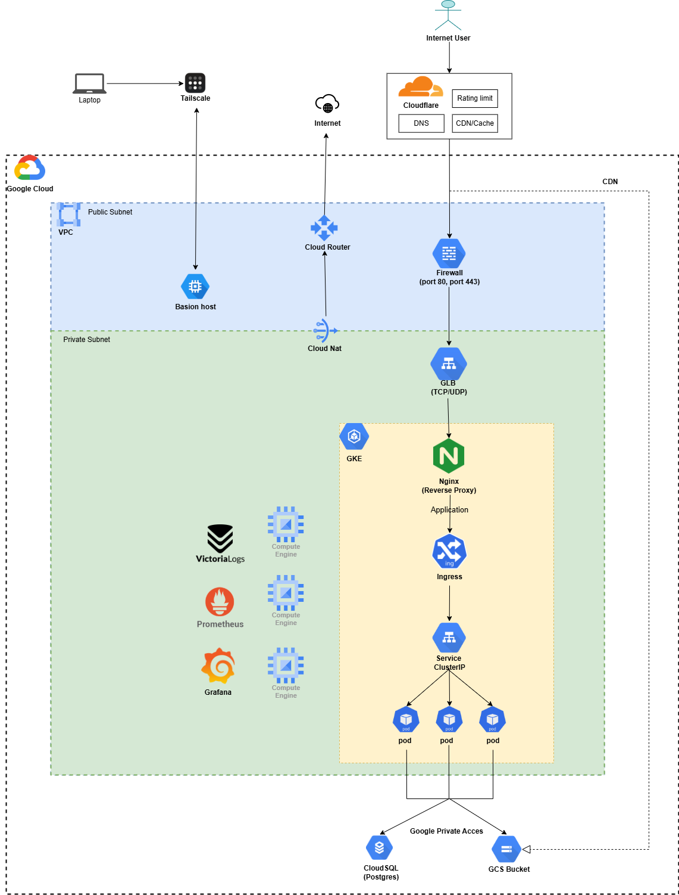

# Hands-on DevOps Projects on GCP

This repository showcases a real-world DevOps infrastructure and deployment setup using **Terraform**, **GKE**, **Helm**, **ArgoCD**, **GitHub Actions**, and more — fully deployed on **Google Cloud Platform**.

---

## Architecture Diagram

This is the high-level architecture of the system:



> Includes:
> - GCP VPC with Public/Private subnets
> - GKE cluster with NGINX Ingress
> - GitOps with ArgoCD
> - CI/CD via GitHub Actions
> - Monitoring with Prometheus + Grafana
> - Centralized logging using VictoriaLogs
> - PostgreSQL (CloudSQL) & GCS via Private Access
> - Security via Tailscale + Cloudflare

---

## Project Structure
```bash
├── argocd # Declare applications to use for ArgoCD (GitOps tool).
├── helm # write helm-chart to deploy todo app
├── k8s # deploy applications or infrastructure using manual Kubernetes manifests
├── terraform # infrastructure management by code
└── todo-app # contains the source code of the main web application (written in Python).
```
---

## Tech Stack

- **Cloud Provider**: Google Cloud Platform (GCP)
- **IaC**: Terraform
- **Container Orchestration**: GKE (Google Kubernetes Engine)
- **CI/CD**: GitHub Actions
- **Package Manager**: Helm
- **Deployment Strategy**: GitOps via ArgoCD
- **Monitoring**: Prometheus + Grafana
- **Logging**: VictoriaLogs
- **Database**: Cloud SQL (PostgreSQL)
- **Security**: Tailscale (Zero Trust VPN), Cloudflare (DNS + WAF)

---

##  Getting Started

### 1️. Provision Infrastructure

```bash
cd terraform
terraform init
terraform plan
terraform apply
```
### 2️. Deploy ArgoCD to GKE
> If not using GitOps, you can apply manually:
```bash
kubectl apply -f k8s/
```
### 3️. Build and Push Docker Image
> This project uses **GitHub Actions** to automatically **build** and **push** a Docker image when changes are pushed to the `main` branch.

CI/CD Workflow Overview

When you push code to the `main` branch:
```bash
1. GitHub Actions checks out the code
2. Logs in to Docker Hub (or GCR)
3. Builds the Docker image using `Dockerfile`
4. Pushes the image to the container registry
```

### 4️. Deploy Application with Helm
```bash
cd helm/chart
helm install todo-app .
```
### Monitoring Stack
- Visit Grafana via exposed Ingress or Port-forward:
```bash
kubectl port-forward svc/grafana 3000:80
```
- Prometheus scrapes metrics from pods, GKE, VictoriaMetrics, etc.
### CI/CD with GitHub Actions
- ```build-image.yml```: Builds and pushes Docker images on commit

- ```release-chart.yml```: Packages and uploads Helm chart
### Security Model
- Cloudflare in front of GLB (Google Load Balancer)
- Firewall rules restrict public access (only ports 80/443)
- Tailscale provides VPN access to bastion
- Private Google Access to access CloudSQL/GCS from GKE
### 
