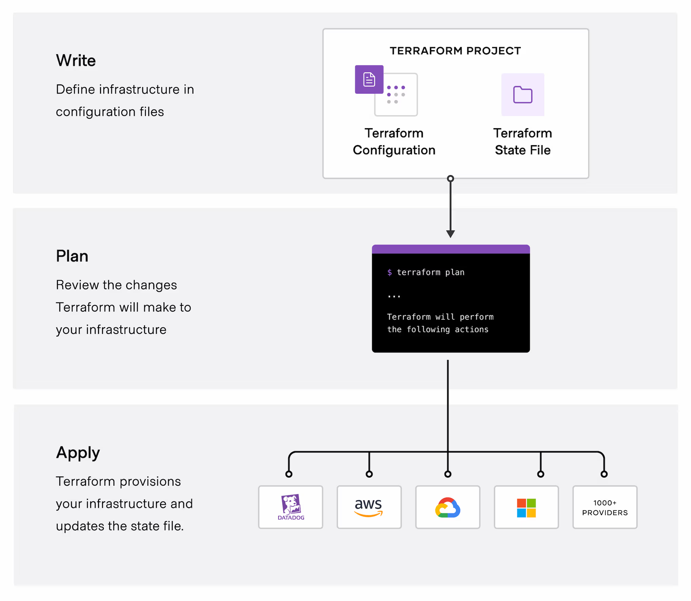

## GCP account setup: gcloud
```
sudo apt-get update  --cập nhật thư viện
sudo apt-get install apt-transport-https ca-certificates gnupg curl  
curl https://packages.cloud.google.com/apt/doc/apt-key.gpg | sudo gpg --dearmor -o /usr/share/keyrings/cloud.google.gpg   # Import the Google Cloud public key

echo "deb [signed-by=/usr/share/keyrings/cloud.google.gpg] https://packages.cloud.google.com/apt cloud-sdk main" | sudo tee -a /etc/apt/sources.list.d/google-cloud-sdk.list    # Add the gcloud CLI distribution URI as a package source

sudo apt-get update && sudo apt-get install google-cloud-cli      #Update and install the gcloud CLI

gcloud init # authen với account google
        -- https://cloud.google.com/sdk/docs/install#deb
```

## Learning terraform/terragunt/teramate
### terraform
```
wget -O - https://apt.releases.hashicorp.com/gpg | sudo gpg --dearmor -o /usr/share/keyrings/hashicorp-archive-keyring.gpg
echo "deb [arch=$(dpkg --print-architecture) signed-by=/usr/share/keyrings/hashicorp-archive-keyring.gpg] https://apt.releases.hashicorp.com $(lsb_release -cs) main" | sudo tee /etc/apt/sources.list.d/hashicorp.list
sudo apt update && sudo apt install terraform

gcloud auth application-default login   # authen google library

terraform init      # khởi tạo thư viện trong terraform

terraform plan   # xem những cái thực thi xóa hay sửa + thêm - xóa

terraform apply     # tạo resource

# file .tfstate KHÔNG ĐƯỢC XÓA, KHÔNG ĐƯỢC ĐẨY LÊN Github, nó chứa các trạng thái các file .tf. Các trạng thái trong file .tfstate nó sẽ hiển thị trên UI

terraform backend: lưu file state lên bucket, sau đó chạy các lệnh: terraform init, terraform plan
có tính năng lock: chỉ được 1 người chạy terraform

https://viblo.asia/p/terraform-series-bai-7-terraform-backend-understand-backend-924lJRr6lPM 

tìm hiểu terraform gồm những gì? như resource, variables,...


```


- Understanding netwoking like TCP/IP, HTTPS/HTTP, ICMP, ...
- Understanding linux 
- Understanding about CI/CD
- Learning docker/k8s
- Learning git


Hands-on on GCP
- Create a VPC, Networking, subnet(private/public), firewall, etc 
    + VPC: tìm hiểu routing mode
    + Secondary subnet trong subnet private làm gì? khi nào dùng tới?
    + router + NAT là cổng duy nhất để đi ra internet khi chỉ có ip private
    + ssh không được ip private thì sử dụng: 
    Cách 1: jump host chỉ một ít server
    ssh -J diemxinh@34.142.193.58 diemxinh@10.1.0.2
    Cách 2: 

- Create a VM for bastion host to connect private subnet
    + telnet: kiểm tra port mở k 
    telnet 34.142.193.58 22
Trying 34.142.193.58...
trying là chưa mở port
    +  ssh diemxinh@34.142.193.58 # ssh lên VM,  thay doi IP
    + tạo thêm firewall: allow-ssh-bastion  từ public vào private port 22


- Setup VPN for connect on local 
    + thêm 2 firewall: allow-openvpn, allow-vpn-to-private
    + ssh lên basion, nếu không được thì kiểm tra = telnet
    + Khi ssh lên nó là quyền user $, nhưng cài đặt cần quyền root # nên là dùng sudo -i
    + Tải script: curl -O https://raw.githubusercontent.com/angristan/openvpn-install/master/openvpn-install.sh
chmod +x openvpn-install.sh
    + Chạy export AUTO_INSTALL=y
./openvpn-install.sh
    + Chạy xong nó có thêm file  client.ovpn, sau đó tải file này từ server xuống local bằng: scp diemxinh@34.142.193.58:/home/diemxinh/client.ovpn .
    + Kiểm tra trạng thái của openvpn (active hay unactive):  systemctl status openvpn@server.service  , thay status = restart nếu unactive
    + Kiểm tra port của openvpn (udp:1194): 
    root@diemne-bastion:/home/diemxinh# netstat -ulnp | grep 1194
    udp        0      0 0.0.0.0:1194            0.0.0.0:*                           4726/openvpn
    + cài netsat: apt install net-tools
    + Kiểm tra local port đã thông với server hay chưa (dùng netcat (UDP) , không dùng telnet vì telnet hoạt động TCP)
    diemdo@DiemDo:~$ nc -vu 34.142.193.58 1194
    Connection to 34.142.193.58 1194 port [udp/openvpn] succeeded!
    +Kiểm tra IP VPN
    
    + Tải openvpnclient để import file client.ovpn vào UI client

    + Cài Tailscale:
    curl -fsSL https://tailscale.com/install.sh | sh
    + Cấu hình trên basion host:
    tailscale up --advertise-routes=10.0.16.0/24,10.1.0.0/20,10.1.16.0/20
    
    sysctl -w net.ipv4.ip_forward=1
    echo 'net.ipv4.ip_forward = 1' >> /etc/sysctl.conf

    + thêm 2 firewall: allow-public-to-private, allow_tailscale_to_console

    + Tạo OS Login
   
    diemdo@DiemDo:~$ gcloud compute os-login ssh-keys add --key-file=/home/diemdo/.ssh/id_ed25519.pub
    

loginProfile:
  name: '103865290085001664828'
  posixAccounts:
  - accountId: diem-do
    gid: '2010053481'
    homeDirectory: /home/ngocdiemdo04_gmail_com
    name: users/ngocdiemdo04@gmail.com/projects/diem-do
    operatingSystemType: LINUX
    primary: true
    uid: '2010053481'
    username: ngocdiemdo04_gmail_com
  sshPublicKeys:
    0356ecfb2d1d4469c70ec9133b437bced364b96e633caacc991f48d8d1ad93b4:
      fingerprint: 0356ecfb2d1d4469c70ec9133b437bced364b96e633caacc991f48d8d1ad93b4
      key: |
        ssh-ed25519 AAAAC3NzaC1lZDI1NTE5AAAAII9sUIVHbCW03UmvOjUj9J8TT8UyYVXmgieg1xKxOKg1 diemxinh
      name: users/ngocdiemdo04@gmail.com/sshPublicKeys/0356ecfb2d1d4469c70ec9133b437bced364b96e633caacc991f48d8d1ad93b4


username: ngocdiemdo04_gmail_com

ssh username@IP

  + Trỏ đường dẫn private key để verify với public key = gcloud
  ssh -v -i ~/.ssh/id_25519 ngocdiemdo04_gmail_com@10.1.0.6
  + Terraform không hỗ trợ gán nhiều member trong một resource google_project_iam_member bằng cách liệt kê nhiều email với dấu phẩy. 
  Mỗi resource chỉ hỗ trợ một member duy nhất.

- Create a Cluster GKE(k8s) via terraform(Add cicd via github action )
  + Tìm hiểu GKE (kubenity), cluster 
  ```
  Sử dụng spot instance để tiết kiệm chi phí
  + spot instance            # GCP hết resource thu hồi lại, sau đó tạo spot mới rồi chạy tiếp
  + preemptible instance     # Chạy trong 24h rồi tắt, bật lại bằng tay
  + On-Demand Instance       # Chạy liên tục
  + stateless                # Chỉ có code
  + statefull                # Lưu db ở code
  ```
  + Tính năng auto scaling


- Using GitOps Workflow with ArgoCD
- Create a application python api simple(Add cicd GA)
- Write a dockerfile to build image on regitry 
- Deploy application to GKE 
- Write a helm chart
- Using helm charts to deploy on gke
- Logging with Victorialog 
- Monitoring with VictoriaMetrics

https://github.com/Frankpromise/Devops-internship-task/tree/master

